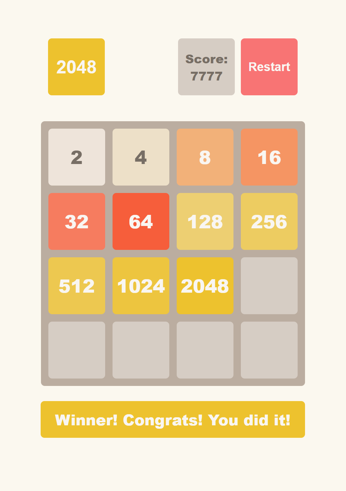

# Game 2048

## Description
A browser-based version of the classic 2048 puzzle game, developed with clean and modular JavaScript code. This version features a responsive 4x4 grid, where a player combine numbered tiles to reach the 2048 tile. The game supports keyboard controls for tile movements and dynamically updates the score, providing an engaging and immersive experience.

## Technologies used
* HTML5
* CSS3
* JS (ES6+)
* GIT

## Instructions for Working with the Project

	1. Open your terminal and run the following command to clone the repository:

        git clone https://github.com/modeltoIT/2048_game.git

	2. Move into the project directory:

        cd 2048_game

	3. Ensure that Node.js version v20.x.x is installed. Verify this by running:

        node -v

        If the version is incorrect, install or update Node.js from Node.js official website.

	4. Install the necessary project dependencies by running:

        npm install

	5. Start the development server with the command:

        npm start

## View Project

* Live Demo: [View the Project](https://modeltoit.github.io/2048_game/)

## Preview

